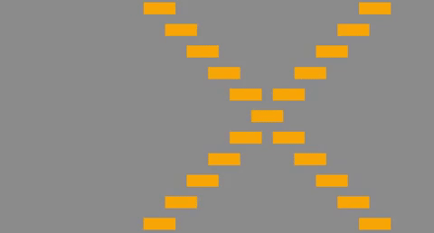

# Object-Oriented Programming (OOP) with Processing

The following exercises have been used in the subjects Object-Oriented Programming (OOP) and Computer Graphics in the program Digital Media Engineering in the university School of Arts and Letters in Bogotá since 2016.2 to 2018.1. taught by Juan Olaya. This subject ... was scripting tool ... used [Processing](https://processing.org/)

To check the example sketches running please visit [OpenProcessing - Juan Olaya](https://www.openprocessing.org/user/65585/)

## Links of the courses
To see and interact with the sketches made the students you can visit:
- [Object-Oriented Programming (2017.2)](https://www.openprocessing.org/class/56631/)
- [Computer Graphics (2017.2)](https://www.openprocessing.org/class/56656/)
- [Computer Graphics (2017.1)](https://www.openprocessing.org/class/56330/)
- [Computer Graphics (2016.2)](https://www.openprocessing.org/class/55669)


## Table of contents
- Class Car (One Instance - Move right Method)
- Class Car (Two Instances - Move right and left Methods)


#### 1. Class Car: 
One Instance + Move Right Method


```
Codigo clase car aqui
```
Download the code to start the course

#### 2. Class Car: 
Two Instances + Move Right/Left Methods


#### 3. Class Car: 
Multiple Instances + ArrayList + Move Right/Left Methods


#### 4. Class Car: 
Rebound Method + Multiple Constructors + ArrayList(Instances) + Move Method


#### 5. Class Car: 
Vectors for Movement + Rebound Method + Multiple Constructors + ArrayList(Instances)


#### 6. Class Ball: 
Vectors for Gravity + Rebound Method + ArrayList(Instances)


#### 7. Coding Challenge 1: 
Multiple instances of the Class Car showing a X



#### 8. Coding Challenge 2: 
Multiple instances of the Class Car showing a X


****************
INCLUIR CLASE BOTON
http://hello.processing.org/
http://www.mas.caad.arch.ethz.ch/mas1011/index85b3.html?p=197
