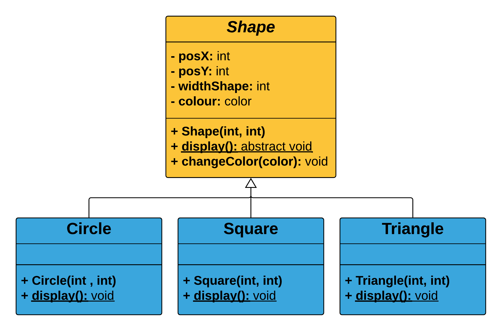

# Object-Oriented Game Development with p5.js

Object-Oriented Programming (OOP) for Game Development with p5.js by [Juan Olaya](https://juanolaya.github.io/)

For this course we use the JavaScript library [P5js](https://p5js.org/) and its Java version [Processing](https://processing.org/).

The following are the course steps:

## Course steps
- [Step 1: One Instance + Function move right](#step-1)
- [Step 2: Two Instances + Functions move right/left](#step-2)
- [Step 3: Multiple Instances + ArrayList + Functions move right/left](#step-3)
- [Step 4: Multiple Instances + ArrayList + Functions move right/left + Rebound Function](#step-4)
- [Step 5: Multiple Instances + ArrayList + Rebound Function + Location Vector + Multiple Constructors](#step-5)
- [Step 6: Multiple Instances + ArrayList + Rebound Function + Velocity Vector + Gravity Vector](#step-6)
- [Coding Challenge 1: Class Car showing a X](#coding-challenge-1)
- [Coding Challenge 2: Class Node showing a network](#coding-challenge-2)

***

#### Step 1: One Instance
One Instance + Function move right. [Download Class Car](https://github.com/JuanOlaya/OOP-Processing/tree/master/Sketches/scriptCar).

[See on OpenProcessing](https://www.openprocessing.org/sketch/550551)

  

  

  

***

#### Step 2: Two Instances
Two Instances + Functions move right/left. 

[See on OpenProcessing](https://www.openprocessing.org/sketch/550553)

  

***

#### Step 3: ArrayList
Multiple Instances + [ArrayList](https://processing.org/reference/ArrayList.html) + Functions move right/left.

[See on OpenProcessing](https://www.openprocessing.org/sketch/550555)

  

  

***

####  Step 4: Alternative Constructor
Rebound Function + Multiple Constructors + Multiple Instances + ArrayList + Functions move right/left.

[See on OpenProcessing](https://www.openprocessing.org/sketch/550558)

  

***

#### Coding Challenge 1:
Multiple instances of the Class Car shaping a X

[See on OpenProcessing](https://www.openprocessing.org/sketch/553532)

  

***

#### Step 5: Vectors
Location Vector + Rebound Function + Multiple Constructors + Multiple Instances + ArrayList.

[See on OpenProcessing](https://www.openprocessing.org/sketch/550560)

  

***

#### Step 6: Gravity
Velocity Vector + Gravity Vector + Rebound Function + Multiple Instances + ArrayList.

[See on OpenProcessing](https://www.openprocessing.org/sketch/550564)

  

***

#### Coding Challenge 2: 
Rotate

[See on OpenProcessing](https://www.openprocessing.org/sketch/553546)

  

***

#### Coding Challenge 3: 
Multiple instances of the Class Node showing a dynamic network

[See on OpenProcessing](https://www.openprocessing.org/sketch/553547)

  

***

#### Coding Challenge 4: 
Multiple instances of the Class Point showing a dynamic network

[See on OpenProcessing](https://www.openprocessing.org/sketch/553549)

***
### Inheritance + Polymorphism
The abstract Class Shape (superclass) extending the following concrete classes (subclasses): Class Circle, Class Square and Class Triangle

[See on OpenProcessing](https://www.openprocessing.org/sketch/556000)

  

***
## Game Mechanics with Object-Oriented Programming (OOP)

#### Player movement with simultaneous keys (OOP):
[Online sketch](https://www.openprocessing.org/sketch/525131)

  

#### Collision Detection (OOP):
[Online sketch](https://www.openprocessing.org/sketch/531753)

  

#### Maze (OOP):
[Online sketch](https://www.openprocessing.org/sketch/492006)

  

#### Bullets (OOP):
[Online sketch](https://www.openprocessing.org/sketch/536000)

  

#### 2 Players Movement + Stop Player by Obstacle (OOP):
[Online sketch](https://www.openprocessing.org/sketch/620035)

  

***
## Bonus: LiveCoding (OOP) with Hydra
We use p5js and OOP in LiveCoding using the tool [Hydra](https://github.com/ojack/hydra) of [Olivia Jackson](https://twitter.com/_ojack_). Hydra is available as a package of the code editor [Atom](https://atom.io/) or online on the [web editor](https://hydra-editor-v1.glitch.me/). [Download the JavaScript OOP code](https://gist.github.com/JuanOlaya/4b6e243910cac1f45d1810eab064c784#file-oopv2-js)

  

[Hydra Example](https://hydra-editor-v1.glitch.me/?sketch_id=gDbMSgZ1Bsb2jcRl&code=JTJGJTJGJTIwYnklMjBKdWFuJTIwT2xheWElMEElMkYlMkYlMjBodHRwcyUzQSUyRiUyRmdpdGh1Yi5jb20lMkZKdWFuT2xheWElMkYlMEElMEElMEElMEFvc2MoMTAlMkMlMjAtMC4xMyklMEElMjAlMjAua2FsZWlkKDcpJTBBJTIwJTIwLmNvbG9yKDElMkMlMjAwJTJDJTIwMC4xKSUwQSUyMCUyMC5yb3RhdGUoMC4xJTJDMC4xKSUwQSUyMCUyMC5jb2xvcmFtYSg5KSUwQSUyMCUyMC5tb2R1bGF0ZShvMCUyQygpJTIwJTNEJTNFJTIwYS5mZnQlNUIwJTVEJTJGMTApJTBBJTIwJTIwLm91dCgp)

***

### Student Sketches
To see and interact online with the sketches made by the students, you can visit the following classes on OpenProcessing:
- [Object-Oriented Programming (2018.2)](https://www.openprocessing.org/class/58337)
- [Object-Oriented Programming (2018.1)](https://www.openprocessing.org/class/57680)
- [Object-Oriented Programming (2017.2)](https://www.openprocessing.org/class/56631/)
- [Computer Graphics (2017.2)](https://www.openprocessing.org/class/56656/)
- [Computer Graphics (2017.1)](https://www.openprocessing.org/class/56330/)
- [Computer Graphics (2016.2)](https://www.openprocessing.org/class/55669)

### Example Sketches - Juan Olaya
For more examples, visit [OpenProcessing - Juan Olaya](https://www.openprocessing.org/user/65585/)

  

***

### JavaScript + UML
- [Object-Oriented JavaScript - Third Edition](https://www.amazon.com/Object-Oriented-JavaScript-Third-Ved-Antani-ebook/dp/B01LXG7M2H)
- [ECMAScript 6](http://es6-features.org/#ClassDefinition)
- [ECMAScript 2015 - Español](https://developer.mozilla.org/es/docs/Web/JavaScript/Referencia/Classes)
- [Abstract Methods and Classes](https://docs.oracle.com/javase/tutorial/java/IandI/abstract.html)
- [Abstract and Concrete Classes](http://www.cems.uwe.ac.uk/~jsa/UMLJavaShortCourse09/CGOutput/Unit9/unit9(0809)/page_03.htm)
- [A guide to prototype-based class inheritance in JavaScript](https://medium.freecodecamp.org/a-guide-to-prototype-based-class-inheritance-in-javascript-84953db26df0)
- [A basic introduction to JavaScript variable definitions and hoisting](https://medium.freecodecamp.org/a-basic-introduction-to-javascript-variable-definitions-and-hoisting-93aa38e742eb)

### Game Design Books
- [Rules of Play: Game Design Fundamentals](https://mitpress.mit.edu/books/rules-play)
- [The Art of Game Design: A Book of Lenses](https://www.amazon.com/Art-Game-Design-Book-Lenses/dp/0123694965)

### Game Development
- [MIT Explains: How To Make a Video Game](https://www.youtube.com/watch?v=Ex1ktxOxVgI&feature=youtu.be)

