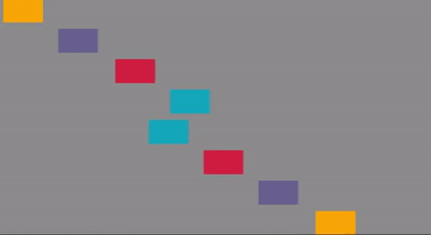

# Object-Oriented Programming (OOP) with Processing

This repository is associated with the courses Object-Oriented Programming (OOP) and Computer Graphics taught in the university [School of Arts and Letters](https://artesyletras.com.co/ingenieria-de-las-artes-digitales/) (Bogotá) by Juan Olaya since the semester 2016.2 to the present. 

For this course we use [Processing](https://processing.org/) and his JavaScript version [P5js](https://p5js.org/). The following are the components required for the course. 

## Table of contents
- Class Car (One Instance - Move right Method)
- Class Car (Two Instances - Move right and left Methods)


#### 1. Class Car: 
One Instance + Move Right Method

<p align="center">
  <a>
    
  </a>
</p>

```
Codigo clase car aqui
```
Download the code to start the course

#### 2. Class Car: 
Two Instances + Move Right/Left Methods

<p align="center">
  <a>
    
  </a>
</p>

#### 3. Class Car: 
Multiple Instances + ArrayList + Move Right/Left Methods

<p align="center">
  <a>
    
  </a>
</p>

#### 4. Class Car: 
Rebound Method + Multiple Constructors + Multiple Instances + ArrayList + Move Method

<p align="center">
  <a>
    
  </a>
</p>

#### 5. Class Car: 
Vectors for Movement + Rebound Method + Multiple Constructors + Multiple Instances + ArrayList

<p align="center">
  <a>
    
  </a>
</p>

#### 6. Class Ball: 
Vectors for Gravity + Rebound Method + + Multiple Instances + ArrayList

<p align="center">
  <a>
    
  </a>
</p>


#### 7. Coding Challenge 1: 
Multiple instances of the Class Car showing a X

<p align="center">
  <a>
    
  </a>
</p>

#### 8. Coding Challenge 2: 
Multiple instances of the Class Node showing a network

<p align="center">
  <a>
    
  </a>
</p>

# STUDENT SKETCHES
To see and interact with the sketches made by the students you can visit:
- [Object-Oriented Programming (2017.2)](https://www.openprocessing.org/class/56631/)
- [Computer Graphics (2017.2)](https://www.openprocessing.org/class/56656/)
- [Computer Graphics (2017.1)](https://www.openprocessing.org/class/56330/)
- [Computer Graphics (2016.2)](https://www.openprocessing.org/class/55669)

# EXAMPLE SKETCHES
To check the example sketches running please visit [OpenProcessing - Juan Olaya](https://www.openprocessing.org/user/65585/)

<p align="center">
  <a href="https://www.openprocessing.org/user/65585/" target="_blank">
    
  </a>
</p>


****************
INCLUIR CLASE BOTON
http://hello.processing.org/
http://www.mas.caad.arch.ethz.ch/mas1011/index85b3.html?p=197
